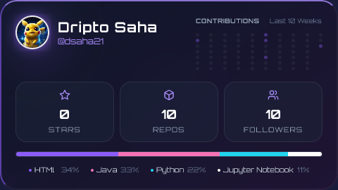

<h1 align='center'>Hi there 👋, I AM DRIPTO !!</h1>
<h3 align='center'>A Software Engineer </h3>
<h4 align='center'><a href="https://dsaha21.github.io/" target="_blank">MY PORTFOLIO</a></h4>
<!-- 
Check out <a href="https://www.freecodecamp.org/" target="_blank">freeCodeCamp</a>.
 -->

    <!--  -->

 

  

  

---

## About Me:

A BTech engineer in Electronics and Computer Science Engineering from KIIT University, keen to explore the world of technologies

Skills: Python, Java, C, Flask etc. (Please visit my Resume for more)

- 🔭 I’m currently working on Comp system basics using C++ and Triton. 
- 🌱 I’m currently learning Comp Arch, compilers and System Design(LLDs and HLDs)
- 📫 How to reach me: Linkedin / Github 
- ⚡ Fun fact: I Keep interest in Quantum Computing, Astronomy, Open World Video Games. Also a human being gets an avg of 4200-4500 weeks during their lifetime. Make everyday count 

## 💻 Tech Stack

  <h3>🔥 Core Technologies</h3>

<table align="center">
  <tr>
    <td align="center" width="96">
      
       Python
    </td>
    <td align="center" width="96">
      
       Java
    </td>
    <td align="center" width="96">
      
       C++
    </td>
    <td align="center" width="96">
      
       JavaScript
    </td>
    
  </tr>
</table>

  <h3>🌐 Web Development Frontend</h3>

<table align="center">
  <tr>
    <td align="center" width="96">
      
       HTML5
    </td>
    <td align="center" width="96">
      
       CSS (Tailwind CSS)
    </td>
    <td align="center" width="96">
      
       React
    </td>
  </tr>
</table>

  <h3>⚙️ Backend & Frameworks</h3>

<table align="center">
  <tr>
    <td align="center" width="110">
      
       Flask
    </td>
    <td align="center" width="110">
      
       FastAPI
    </td>
  </tr>
</table>

  <h3>🗄️ Database & Tools</h3>

<table align="center">
  <tr>
    <td align="center" width="96">
      
       MySQL
    </td>
    <td align="center" width="96">
      
       GitHub
    </td>
    <td align="center" width="96">
      
       Git
    </td>
    <td align="center" width="96">
      
       VS Code
    </td>
    <td align="center" width="96">
      
       Linux
    </td>
  </tr>
</table>

<!--
**dsaha21/dsaha21** is a ✨ _special_ ✨ repository because its `README.md` (this file) appears on your GitHub profile.
https://github.com/dsaha21/dsaha21/blob/main/GlaringTanCanary.webp
Here are some ideas to get you started:

- 🔭 I’m currently working on ...
- 🌱 I’m currently learning ...
- 👯 I’m looking to collaborate on ...
- 🤔 I’m looking for help with ...
- 💬 Ask me about ...
- 📫 How to reach me: ...
- 😄 Pronouns: ...
- ⚡ Fun fact: ...
-->
